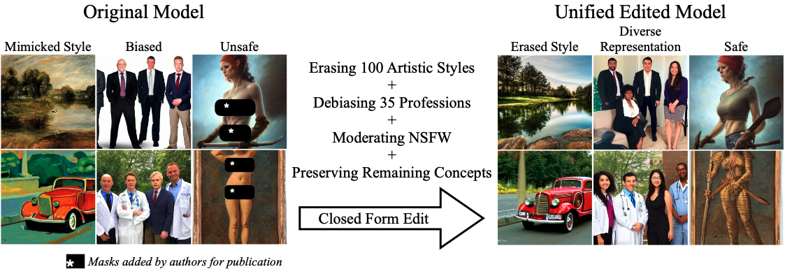
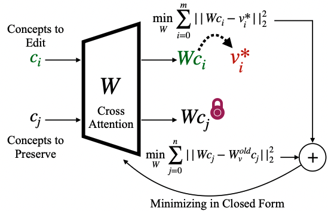

# Unified Concept Editing in Diffusion Models
###  [Project Website](https://unified.baulab.info) | [Arxiv Preprint](https://arxiv.org/pdf/2308.14761.pdf)
<div align='center'>

</div>

Model-editing methods can be used to address individual issues of bias, copyright, and offensive content in text-to-image models, but in the real world, all of these issues will appear simultaneously in the same model. We present an algorithm that scales seamlessly to concurrent edits on text-conditional diffusion models. Our method, Unified Concept Editing (UCE) enables debiasing multiple attributes simultaneously while also erasing artistic styles en masse to address copyright and reducing potentially offensive content. <br>

Specifically, we demonstrate scalable simultaneous debiasing, style erasure, and content moderation by editing text-to-image projections. We concurrently debiase multiple professions across gender and race. To address copyright, we erase styles at scale with minimal interference. For content safety, we regulate many unsafe concepts together. Our interpretable editing allows addressing all these issues concurrently, and we present extensive experiments demonstrating improved scalability over prior work.
<div align='center'>

</div>

## Installation Guide

The code base is based on the `diffusers` package. To get started:
```
git clone https://github.com/rohitgandikota/unified-concept-editing.git
cd unified-concept-editing
mkdir models
pip install -r requirements.txt
```

## Training Guide

After installation, follow these instructions to train a custom UCE model:
### Erasing
To erase concepts (e.g. "Kelly Mckernan, Sarah Anderson")
```
python train-scripts/train_erase.py --concepts 'Kelly Mckernan, Sarah Anderson' --guided_concept 'art' --device 'cuda:0' --concept_type 'art'
```

### Debiasing
To debias concepts (e.g. "Doctor, Nurse, Carpenter") against attributes (e.g. "Male, Female") 
```
python train-scripts/train_debias.py --concept 'Doctor, Nurse, Carpenter' --attributes 'male, female' --device 'cuda:0'
```

### Moderating
To moderate concepts (e.g. "violence, nudity, harm")
```
python train-scripts/train_erase.py --concepts 'violence, nudity, harm' --device 'cuda:0' --concept_type 'unsafe'
```

## Generation Images

To use `eval-scripts/generate-images.py` you would need a CSV file with columns `prompt`, `evaluation_seed`, and `case_number`. (Sample data in `data/`)
```
python eval-scripts/generate-images.py --model_name='erased-imagenette-towards_uncond-preserve_false-sd_1_4-method_replace.pt' --prompts_path 'data/imagenette.csv' --save_path 'evaluation_folder' --num_samples 5 --ddim_steps 50
```

## Citing our work
The preprint can be cited as follows
```
@article{gandikota2023unified,
  title={Unified Concept Editing in Diffusion Models},
  author={Rohit Gandikota and Hadas Orgad and Yonatan Belinkov and Joanna Materzy\'nska and David Bau},
  journal={arXiv preprint arXiv:2308.14761},
  year={2023}
}
```
